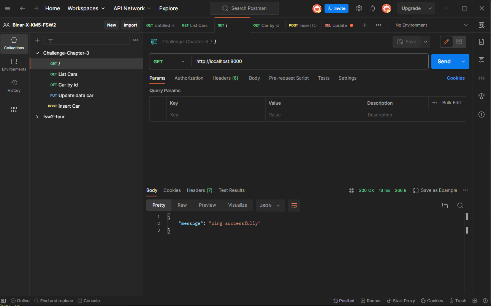
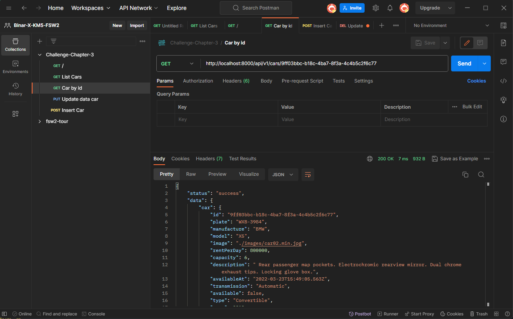
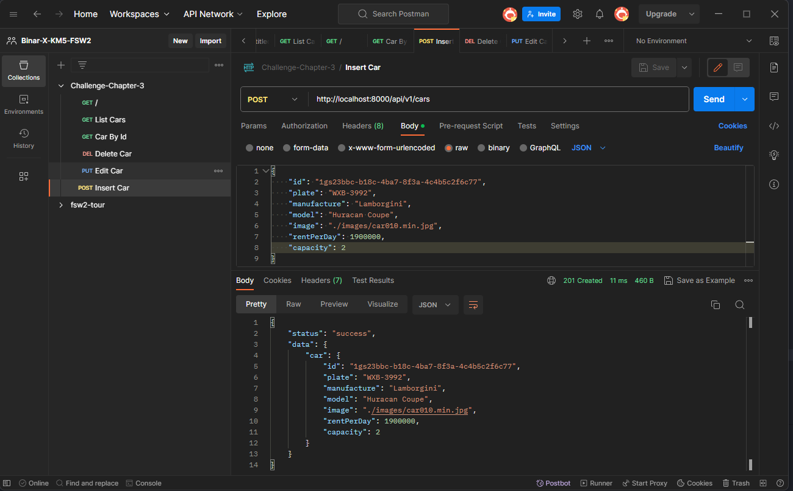
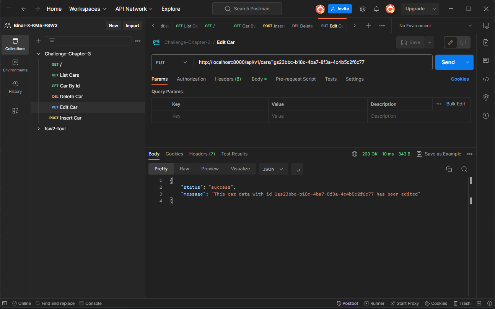
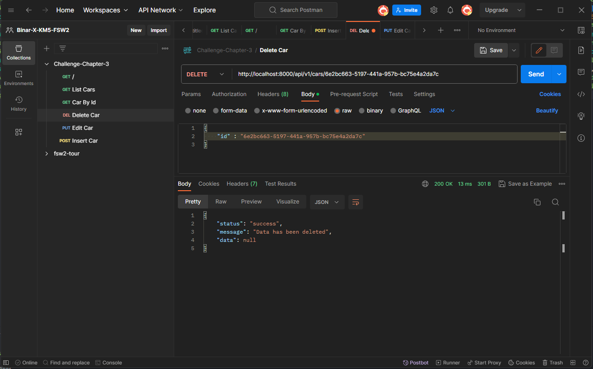

# Daily Task Chapter 3

- Create REST API CRUD Users, menggunakan data users.json lalu refactor routing di 2 resource

##### Hasil Dari Postman

1. Ping Successfully
   

###

2. Get List Cars
   

###

3. Get Car By Id
   

###

4. Insert Car
   

###

5. Edit Car
   

###

6. Delete Car
   
